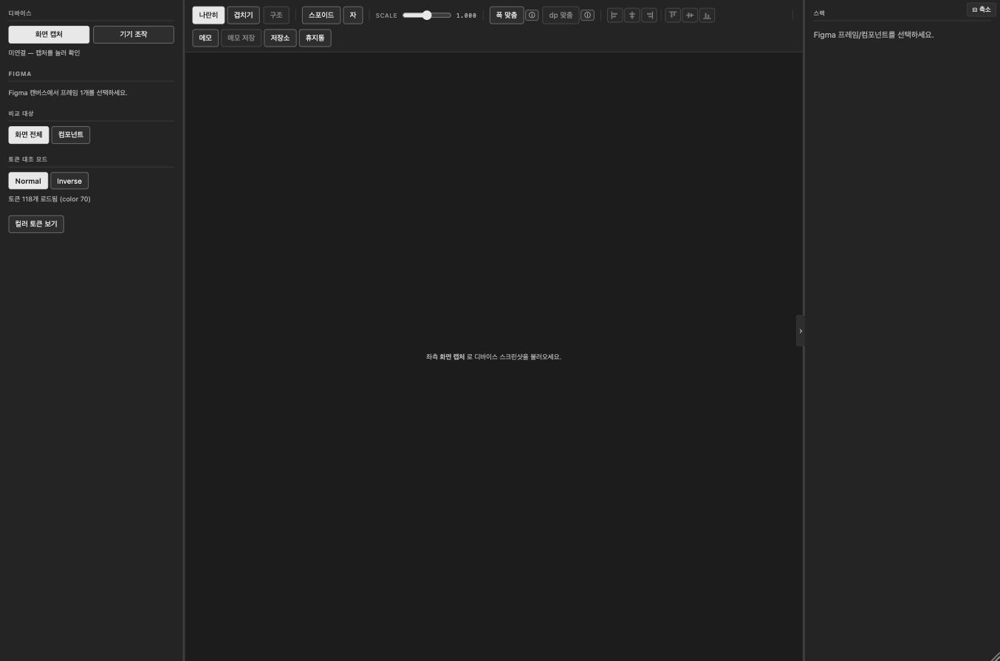
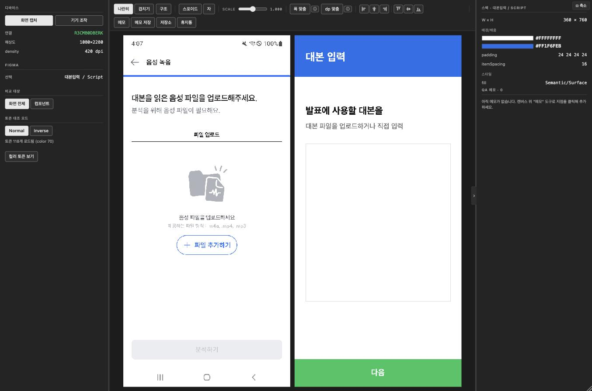
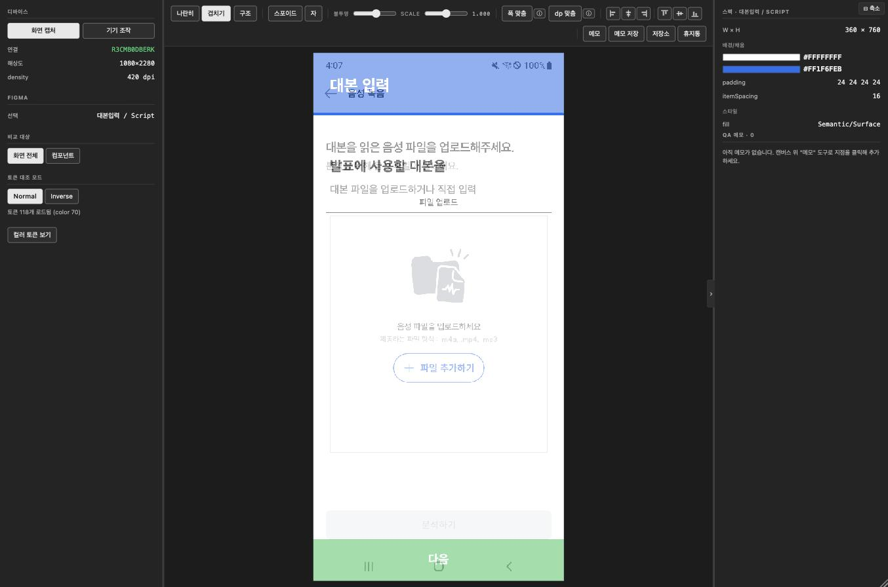
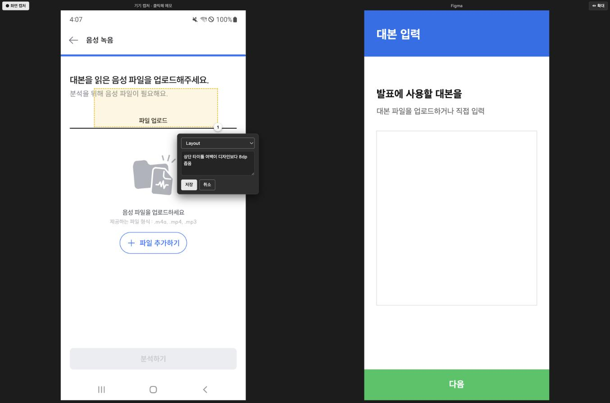
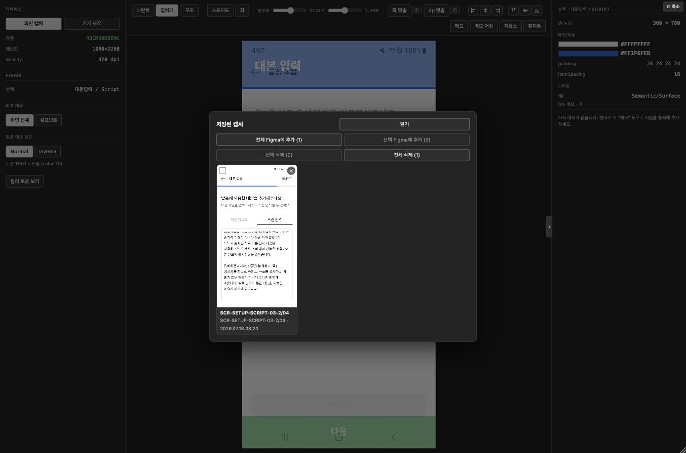
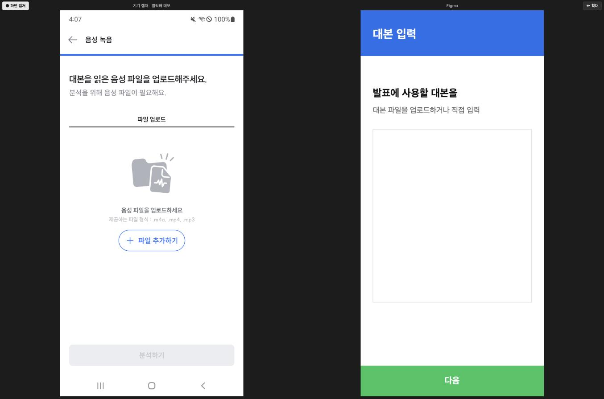

# 사용 가이드 — 디자인 QA 대조 플러그인

개발 세팅 없이, **플러그인을 켠 뒤 뭘 할 수 있는지**만 정리한 문서.
아직 안 켜봤다면 [`SETUP_TEAM.md`](SETUP_TEAM.md)로 먼저 세팅하세요.

---

## 0. 시작하기

1. `design-qa-plugin` 폴더의 **`run.command` 더블클릭** → 헬퍼 서버가 켜집니다(그 창은 켜둔 채로).
2. Figma Desktop에서 **Plugins → Development → Design QA 대조 (플러그인)** 실행.
3. 갤럭시를 USB로 연결.

플러그인 창 왼쪽에 **"토큰 118개 로드됨"** 이 보이면 서버와 잘 연결된 것입니다.

---

## 1. 이 플러그인으로 하는 것

Figma 디자인과 실제 안드로이드 화면(갤럭시 실기기)을 나란히 놓거나 겹쳐서,
색·간격·레이아웃이 디자인과 맞는지 눈으로 대조하고 QA 메모를 남기는 도구.
**웹 툴과 달리 Figma 안에서 돌기 때문에**, 대조할 디자인은 캔버스에서 프레임을 **선택만** 하면 됩니다.

화면은 3분할입니다 — **왼쪽**(기기·비교대상·토큰), **가운데**(대조 캔버스), **오른쪽**(스펙·QA 메모 목록).

---

## 2. 화면 만들기

좌측 패널에서:

1. **기기 조작** — 갤럭시 화면이 별도 창으로 뜨고, 마우스·키보드로 폰을 그대로 조작할 수 있다.
   손에 들지 않고 대조할 화면까지 가는 용도. (scrcpy가 깔려 있어야 동작 — 없으면 이 버튼만 안 됨)
2. **화면 캡처** — USB로 연결된 갤럭시의 현재 화면을 그대로 가져온다.
   실기기 대신 **Android Studio 에뮬레이터(가상 기기)** 를 써도 똑같이 잡힌다(세팅은 `SETUP_TEAM.md` 6번 참고).
3. **Figma 캔버스에서 프레임 1개를 선택** — 좌측 "선택"에 프레임 이름이 뜨고, 우측 대조 영역과
   스펙 패널에 자동으로 반영된다. **fileKey 를 입력할 필요가 없다** — 지금 보고 있는 파일에서 고른 것을 바로 읽는다.
4. **비교 대상**을 "화면 전체" 또는 "컴포넌트"(선택 프레임의 하위 인스턴스)로 전환 가능.

> 프레임을 바꿔 선택하면 그때그때 대조 화면이 갱신된다.

---

## 3. 비교 모드 — 나란히 / 겹치기

캔버스 상단 툴바 왼쪽에서 전환.

- **나란히** — 기기 화면과 Figma 화면을 옆으로 붙여서 봄.
- **겹치기** — 한 화면 위에 반투명하게 겹침. 겹치기일 때만 **불투명** 슬라이더가 뜬다.

**구조** — 바로 옆의 별도 토글. 기기 화면의 레이아웃 경계를 파란 선으로 덮어 보여준다.
"이 여백이 패딩인지 마진인지", "이게 한 덩어리인지 따로인지"를 볼 때 쓴다.
모드가 아니라 켜고 끄는 보기라 어느 모드에서든 같이 켤 수 있다.
Compose 화면은 경계 정보가 없어 버튼이 비활성이다(9번 참고).

---

## 4. 맞춤 / 정렬

같은 툴바 안에 모여 있음.

- **scale** 슬라이더 — Figma 레이어 크기를 미세 조정.
- **폭 맞춤** — Figma를 기기 폭에 꽉 채움(디자인·기기 폭이 다르면 실제보다 크거나 작게 보일 수 있음).
- **dp 맞춤** — 1 디자인-dp = 1 기기-dp가 되도록 실제 크기 그대로 보여줌. **크기·간격을 정확히 볼 땐 이걸 기본으로.**
  두 버튼 다 ⓘ를 누르면 설명이 뜨고, 누른 버튼은 다시 누르기 전까지 활성 표시가 남는다.
- **정렬 아이콘 6개**(가로 좌/가운데/우, 세로 위/가운데/아래) — 누르면 그 방향으로 자동 정렬. 같은 아이콘 다시 누르면 해제.
- **직접 드래그** — 도구를 아무것도 안 고른 상태에서 Figma 레이어를 마우스로 직접 끌 수 있음. 기기 화면 가장자리/가운데에 가까워지면 자동 스냅.
- **방향키** — ←↑↓→ 로 1px씩 미세 이동.
- 오프셋이 0이 아니면 캔버스 우측 하단에 `x/y(dp)` 값과 **Reset**(↺) 버튼이 뜬다.

---

## 5. 도구 3종 (스포이드 / 자 / 메모)

툴바 가운데 그룹. 하나를 누르면 활성화(파란색), 다시 누르면 해제.

### 스포이드
기기 화면 위 아무 곳이나 클릭(또는 누른 채 드래그)하면 그 지점의 색을 뽑아서,
디자인 토큰 중 가장 가까운 후보들을 **확률 랭킹 리스트**로 오른쪽 패널에 보여준다.
드래그하는 동안 커서 옆에 픽셀 확대 돋보기가 뜬다.

### 자
두 지점을 순서대로 클릭하면 그 사이 거리(dp)와 가장 가까운 간격 토큰을 보여준다.

### 메모 (QA 어노테이션)
자세한 내용은 아래 6번 참고.

**Normal / Inverse** (좌측 패널) — 라이트/다크 등 어떤 모드 기준으로 토큰을 대조할지 전환.
스포이드/자 결과 모두 이 기준을 따른다.

---

## 6. 메모(QA 어노테이션)

Figma 주석처럼, 기기 화면 위에 번호 핀을 찍고 QA 코멘트를 남기는 기능.

- **메모 도구**는 툴바 맨 오른쪽에 "메모 저장"/"저장소"와 함께 그룹으로 묶여 있음.
- 화면을 **클릭**하면 그 지점에 점 메모, **드래그**하면 그 영역에 영역 메모가 생긴다(드래그 중 노란 영역이 미리 보인다).
- 메모를 남길 때 **카테고리**를 고른다: `Color` / `Text` / `Image` / `Layout` / `Motion`. 카테고리마다 색이 다른 칩으로 표시됨.
- 핀을 클릭하면 카드가 열려서 내용을 보거나 수정·삭제할 수 있다. 카드 바깥을 클릭하면 자동으로 닫힘.
- 오른쪽 패널 하단에 현재 화면에 남긴 메모 목록이 전부 뜬다.

---

## 7. 메모 저장 / 저장소 → Figma에 추가

메모는 **화면 캡처를 새로 할 때마다 새 묶음(세션)** 으로 나뉜다. "이 캡처에 남긴 메모들"이 하나의 단위.

- **재캡처할 때** — 지금 세션에 저장 안 된 메모가 있는 상태로 "화면 캡처"를 다시 누르면 저장 확인창이 뜬다.
  - **저장하기** — 이름 붙여 저장소에 보관 / **저장 안 함** — 지금 메모를 버리고 새로 캡처 / **취소**.
- **메모 저장** 버튼 — 재캡처 없이도, 지금 화면+메모 상태를 그대로 저장소에 저장.
- 이름은 지금 보고 있는 화면 ID가 기본으로 채워짐. 같은 이름이 있으면 **덮어쓰기 / 둘 다 보관 / 취소** 중에 고른다.

**저장소** 버튼 — 지금까지 저장한 캡처들을 썸네일로 모아 보여줌.

- 썸네일을 클릭하면 그 캡처 화면 + 메모가 캔버스로 다시 불러와져서 이어서 작업 가능.
- 카드의 ✕로 개별 삭제(휴지통으로 감 — 옆의 **휴지통** 버튼에서 복원 가능).
- **전체 Figma에 추가 / 선택 Figma에 추가** — 캡처 이미지 위에 QA 메모(핀+카드)를 그려서,
  **지금 보고 있는 Figma 페이지의 화면 중앙에 이미지 노드로 추가**한다. 추가된 노드는 선택된 상태라
  바로 `Cmd+C` 로 복사해 다른 곳(Slack, 문서 등)에 붙여넣을 수 있다.
  - 메모가 2개 이상이면 한 장에 하나씩 나온다(이슈 하나씩 따로 전달하기 좋다).

> 웹 툴의 "PNG로 내보내기(zip)"는 이 플러그인에선 **"Figma에 추가"** 로 바뀌었습니다.
> 플러그인 환경에선 OS 클립보드로 이미지를 바로 복사할 수 없어서, Figma 안에 이미지로 넣습니다.

---

## 8. 축소(compact) 뷰

우상단 **"⊟ 축소"** — 좌측 컨트롤·툴바·우측 스펙을 다 숨기고, **기기 캡처와 선택한 Figma 화면
2개만 나란히** 크게 보는 모드. 창도 작아진다.

- 축소 상태에서도 **● 화면 캡처**(좌상단)로 기기를 다시 캡처할 수 있다.
- 축소 상태에서도 기기 화면을 **클릭/드래그해 메모**를 남길 수 있다(전체 뷰와 같은 메모).
- **↔ 확대**로 원래 화면으로 돌아온다.

---

## 9. 창 크기 / 패널 접기

- **창 크기 조절** — 플러그인 창 **우하단 모서리**를 드래그하면 창 크기가 바뀐다(크기는 기억됨).
- **우측 스펙 패널 접기** — 스펙 패널 왼쪽 가장자리(세로 가운데)에 붙은 **화살표 아이콘 탭**(`›`/`‹`)을 누르면
  스펙 패널을 접었다 펼 수 있다. 접으면 가운데 대조 영역이 넓어진다.

---

## 10. 컬러 토큰 뷰어

좌측 패널 **컬러 토큰 보기** — 전체 컬러 토큰을 스와치 그리드로 훑어볼 수 있는 창.

- 이름으로 검색, **Normal/Inverse** 필터.
- 토큰 이름의 그룹별로 탭이 자동으로 나뉨.
- 스와치를 클릭하면 hex 값이 복사됨.

---

## 11. 자주 헷갈리는 것

- **디자인이 안 들어와요** — Figma 캔버스에서 **프레임을 선택**해야 한다. 좌측 "선택"에 이름이 떠야 반영된 것.
- **플러그인이 검은 화면 / "헬퍼 서버에 연결할 수 없습니다"** — `run.command` 터미널 창이 켜져 있어야 한다(기기 캡처·토큰이 그 서버에서 온다). 창을 닫았다면 다시 더블클릭.
- **폭 맞춤 vs dp 맞춤** — 폭 맞춤은 "화면을 꽉 채워 레이아웃 훑어보기"용, dp 맞춤은 "실제 크기가 맞는지 검증"용.
  디자인 폭(360dp)이 기기 폭(411dp)보다 좁으면 dp 맞춤에선 한쪽에 여백이 생기는 게 정상 — 그게 크기 차이를 보여주는 것.
- **기기 조작 화면이 대조 영역에 안 들어와요** — 미러링은 별도 창으로만 뜬다(정상). 대조·스포이드·자는 **캡처한 정지 화면** 위에서만 동작하므로, 미러링 창에서 화면을 맞춘 뒤 **화면 캡처**를 눌러야 들어온다.
- **메모가 안 보여요** — 메모는 Figma 프레임이 아니라 **캡처 세션** 기준으로 저장된다. 다른 캡처를 저장소에서 불러오면 그때 메모가 같이 따라온다.
- **Compose 화면에서 "구조" 버튼이 안 눌려요** — Compose는 레이아웃 경계 정보가 비어있는 경우가 있다(정상). 이럴 땐 메모를 영역으로 드래그해서 표시.
